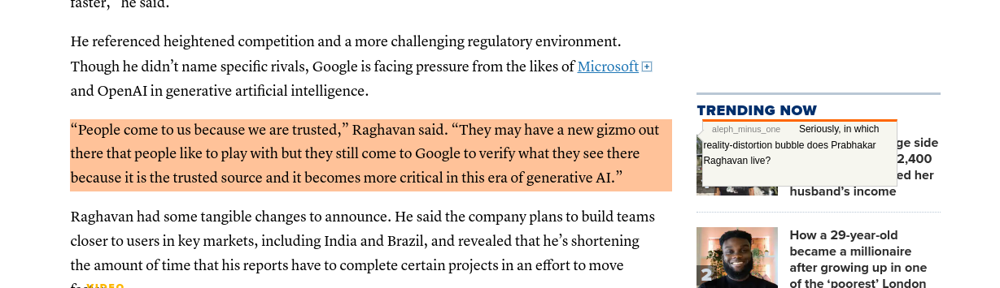

# What Hacker News says
Web Extension: View Hacker News quotes inline

## About
Extends pinoceniccola's dead-simple yet very useful web extension that looks for threads on popular social news aggregator [Hacker News](https://news.ycombinator.com/news) via [HN Search API powered by Algolia](https://hn.algolia.com/api). 

After the extension button is pressed, the HN threads are showed. Comments in these threads that quote the article will then be highlighted. The comment can be viewed by hovering over the highlight.

HN comments that quote the article are categorised by those that start with ">" and then respond after a new line.

## Install
Get the extension for [Firefox](https://addons.mozilla.org/en-US/firefox/addon/what-hacker-news-says/) or [Chrome/Chromium](https://chrome.google.com/webstore/detail/what-hacker-news-says/khgegkjchclhgpglloficdmdannlpmoi) browsers.

You can also clone this repo and manually run it as an unpacked extension (but losing automatic future updates).

## Changelog
See [CHANGELOG.md](CHANGELOG.md).

## License
© philrhc. MIT License.

